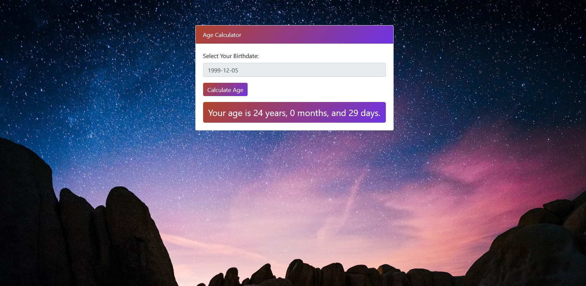

# Age Calculator

## Description

A simple age calculator web application that allows users to input their birthdate and calculate their age. The application is designed with a clean and responsive user interface.

## Features

- **Bootstrap Integration:** Utilizes Bootstrap 4.5.2 for a modern and responsive design.
- **Date Picker:** Integrates Flatpickr for easy date selection.
- **Background Image:** Displays a background image sourced from Unsplash.
- **Age Calculation:** Calculates age in years, months, and days based on the selected birthdate.

## Usage

1. Access the application on any modern web browser.
2. Select your birthdate using the date picker.
3. Click the "Calculate Age" button to view your age in years, months, and days.

## Installation

No installation is required; simply open the HTML file in a web browser.

## Technologies Used

- HTML
- CSS (Bootstrap)
- JavaScript (jQuery, Flatpickr)

## Preview

[(https://simple-age-calculator-lovat.vercel.app/)](#)

## Contributing

Contributions are welcome! Feel free to submit issues or pull requests.

## License

Free to use 😊💖

